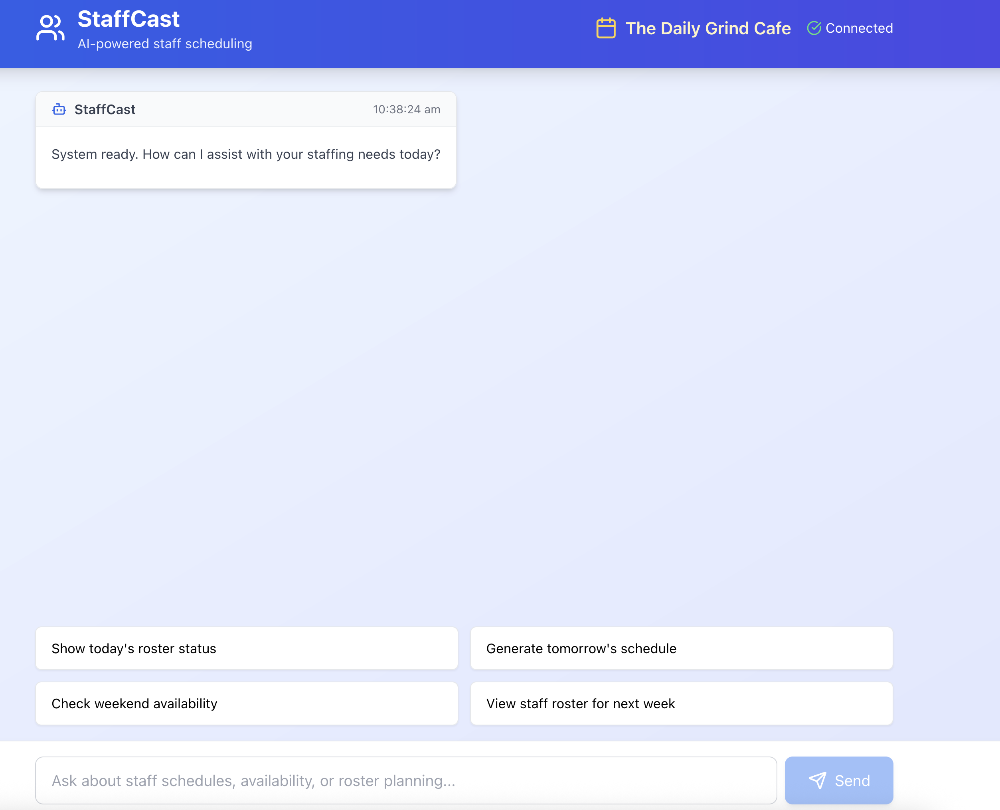

# StaffCast - AI-Powered Dual-Portal Staff Management System

An intelligent staff management system with dual portals (Manager & Staff) that leverages AI agents for roster optimization, policy search, and comprehensive workforce management. Built with Amazon Bedrock, Strands SDK, Amazon AgentCore and Model Context Protocol (MCP).

## Overview

StaffCast transforms traditional workforce management by providing separate, optimized experiences for managers and staff members. The system combines AI-powered decision making with real-time data integration across two distinct portals:

### Manager Portal
- Complete roster generation and optimization
- Staff management and approval workflows
- Business-wide reporting and analytics
- Payroll and certification tracking
- Full MCP tool access

### Staff Portal 
- Personal schedule and availability management
- Leave request submission
- Company policy search via Bedrock Knowledge Base
- Training and certification tracking
- Restricted, secure access to personal data only

This project demonstrates how to build modern dual-portal AI applications with role-based access control, integrating multiple data sources through MCP servers and AWS Bedrock Knowledge Bases.

**Core Requirements**:
- **Dual Web Servers**: Manager API + Staff API. Agents hosted on Amazon AgentCore
- **Restricted AI Agent**: Staff portal with limited MCP tool access (personal data only)
- **Knowledge Base Integration**: Amazon Bedrock Knowledge Base for company policy search via native Strands tools, check this link for an example https://strandsagents.com/latest/documentation/docs/examples/python/knowledge_base_agent/
- **Enhanced Database**: Staff information with certifications, payroll, and training tables
- **Professional Frontend**: Material UI split-screen interface (chat + data panel)
- **Multi-tenant Ready**: Modular architecture supporting multiple companies
- **Demo Setup**: Hardcoded staff member (Emma Davis at The Daily Grind Cafe) for initial testing

**Key Innovation**: This system showcases how to create role-based AI agents where the same underlying MCP tools provide different levels of access and data filtering based on user context, combined with AI-powered policy search capabilities.

## Tags

- bedrock
- python
- staff-scheduling
- strands
- mcp
- agents
- dynamodb
- fastapi
- react
- workforce-management

## Technologies

- **Backend**: Python 3.10+, Strands Agents SDK
- **Database**: Amazon DynamoDB (7 tables + GSIs)
- **AI**: Amazon Bedrock (Claude 3.5 Sonnet) + Knowledge Base
- **Vector Search**: Amazon OpenSearch Serverless
- **Agent hosting**: Amazon AgentCore
- **Storage**: Amazon S3 (Private, encrypted)
- **Infrastructure**: AWS CloudFormation (3 templates)
- **Observability**: Langfuse and Cloudwatch
- **Protocol**: AgentCore Gateway with Model Context Protocol (MCP)
- **Frontend**: React, Material UI, WebSockets, Split-screen Layout

## Features

### Manager Portal Features
- **Intelligent Roster Generation**: AI-powered scheduling considering multiple factors
- **Staff Management**: Comprehensive staff profiles with skills, certifications, and preferences
- **Holiday Management**: Approve/deny leave requests with workflow
- **Availability Tracking**: View and manage all staff availability
- **Payroll Management**: Track hours, wages, and payment history
- **Certification Tracking**: Monitor compliance and renewal requirements
- **Training Management**: Oversee staff development and course completion
- **Real-time Updates**: WebSocket-based streaming responses
- **Multi-business Support**: Secure multi-tenant architecture

### Staff Portal Features
- **Personal Schedule**: View upcoming shifts and roster assignments
- **Availability Management**: Set and update personal availability
- **Leave Requests**: Submit holiday and time-off requests
- **Company Policy Search**: AI-powered search through company documentation via Bedrock Knowledge Base
- **Personal Records**: View own payroll, certifications, and training history
- **Real-time Chat**: WebSocket-based AI assistant for work-related questions
- **Secure Access**: Role-based restrictions ensuring data privacy

## Frontend

### Split-Screen Layout Design
- **Left Panel**: AI chat interface for natural language interaction
- **Right Panel**: Dynamic data display that updates based on conversation context
- **Responsive**: Professional Material UI components with clean, modern design
- **Real-time**: WebSocket connection for streaming AI responses

### Panel Types and Behavior
1. **Roster Panel**: Triggered by schedule/roster discussions
   - Display upcoming shifts in calendar/table format
   - Highlight relevant shifts based on conversation context
   
2. **Leave Panel**: Triggered by holiday/time-off discussions  
   - Show pending/approved leave requests
   - Display leave balances and available days
   
3. **Availability Panel**: Triggered by availability discussions
   - Show current availability settings
   - Allow inline editing of availability preferences
   
4. **Payroll Panel**: Triggered by payroll/hours discussions
   - Display recent payroll information (staff see own only)
   - Show hours worked and payment summaries

### Demo Configuration
- **Staff Member**: Emma Davis (emma_davis) - Barista at The Daily Grind Cafe
- **Demo Period**: August 27 - September 9, 2025
- **Business ID**: cafe-001
- **Use Cases**: Personal schedule, leave requests, company policy search

## Dual-Portal Architecture

```
┌─────────────────┐    ┌─────────────────┐
│  Manager Portal │    │  Staff Portal   │
│                 │    │                 │
│ React + MUI     │    │ React + MUI     │
│ Split-screen UI │    │ Split-screen UI │
│ (Port 3000)     │    │ (Port 3001)     │
└─────────────────┘    └─────────────────┘
         │                       │
         ▼                       ▼
┌─────────────────┐    ┌─────────────────┐
│ Manager         │    │ Staff           │ 
│AgentCore Runtime│    │AgentCore Runtime│
│                 │    │                 │
│ Full MCP Access │    │ Restricted MCP  │
│ All Operations  │    │ Personal Data   │
└─────────────────┘    └─────────────────┘
         │                       │  │             
         └───────────┬───────────┘  └──────────┐       
                     │                         │
         ┌───────────▼──────────────────────┐  │
         │      AgentCore Gateway.          │  │
         │                                  │  │
         │                                  │  │
         │ ┌─────────────┐ ┌──────────────┐ │  │
         │ │Tool Access  │ │Data Filtering│ │  │
         │ │Control      │ │& Validation  │ │  │
         │ └─────────────┘ └──────────────┘ │  │
         └──────────────────────────────────┘  │
                     │                         │
         ┌───────────┘           ┌─────────────┘
         │                       │
         ▼                       ▼
┌─────────────────┐    ┌─────────────────────────┐
│   DynamoDB      │    │    Bedrock Knowledge    │
│   (7 Tables)    │    │         Base            │
│                 │    │                         │
│ • Staff         │    │ ┌─────────────────────┐ │
│ • Rosters       │    │ │    S3 Bucket        │ │
│ • Availability  │    │ │   (Private)         │ │
│ • Holidays      │    │ │ Policy Documents    │ │
│ • Certifications│    │ └─────────────────────┘ │
│ • Payroll       │    │           │             │
│ • Training      │    │           ▼             │
└─────────────────┘    │ ┌─────────────────────┐ │
                       │ │OpenSearch Serverless│ │
                       │ │   Vector Index      │ │
                       │ └─────────────────────┘ │
                       └─────────────────────────┘
```

## AgentCore Deployment

Deploy StaffCast as production-ready dual-portal agents using Amazon Bedrock AgentCore.

### Prerequisites
- Python 3.10+
- Node.js 18+
- AWS Account with Amazon Bedrock and DynamoDB access
- AWS CLI configured with appropriate permissions
- AWS credentials configured

#### Setup deployment environment 
```bash
# Install Python dependencies
python -m venv .venv
source .venv/bin/activate
pip install -r requirements.txt

# Configure AWS CLI and enable Bedrock models - This step is only required if you are not using IAM Role
aws configure
```

#### Enable Amazon Bedrock Models
1. Go to the [Amazon Bedrock Console](https://console.aws.amazon.com/bedrock/)
2. Make sure you are in your desired region (us-west-2) - right top corner will tell you the current region
3. Navigate to "Model access" in the left panel
4. Click "Request model access"
5. Enable access to:
   - **Claude 3.5 Sonnet v2 and/or Claude Sonnet 4** (for AI agent responses)
   - **Cohere Embed Multilingual v3** (for Knowledge Base embeddings)
6. Save changes and wait for approval

### Step 1: Deploy Infrastructure
**Step 1: Get Your AWS Identity (Required for OpenSearch Access)**
```bash
# Set your AWS region
export AWS_DEFAULT_REGION=us-west-2

# Get your current AWS identity ARN (needed for OpenSearch data access policy)
export USER_ARN=$(aws sts get-caller-identity --query Arn --output text)
echo "Your AWS Identity ARN: $USER_ARN"
```

**Step 2: Deploy Core Infrastructure (DynamoDB Tables)**
```bash
# Deploy core infrastructure (DynamoDB tables)
aws cloudformation create-stack \
  --stack-name staffcast-core-dev \
  --template-body file://cloudformation-dynamodb.yml \
  --parameters ParameterKey=Environment,ParameterValue=dev \
               ParameterKey=ProjectName,ParameterValue=staffcast \
               ParameterKey=AWSRegion,ParameterValue=${AWS_DEFAULT_REGION} \
  --capabilities CAPABILITY_NAMED_IAM \
  --region ${AWS_DEFAULT_REGION}

# Wait for completion and verify outputs
aws cloudformation wait stack-create-complete --stack-name staffcast-core-dev --region ${AWS_DEFAULT_REGION}
aws cloudformation describe-stacks --stack-name staffcast-core-dev --region ${AWS_DEFAULT_REGION} --query 'Stacks[0].Outputs'
```

**Step 4: Explore the tables**
1. Go to the [Amazon DynamoDB Console](http://console.aws.amazon.com/dynamodbv2/)
2. Click on `Explore Items`
3. You will see 5 tables, they should have no items.

**Step 5: Deploy OpenSearch Collection + Knowledge Base Role**
```bash
# Deploy OpenSearch collection with Knowledge Base role and access policies
aws cloudformation create-stack \
  --stack-name staffcast-opensearch-dev \
  --template-body file://cloudformation-opensearch-collection.yml \
  --parameters ParameterKey=Environment,ParameterValue=dev \
               ParameterKey=ProjectName,ParameterValue=staffcast \
               ParameterKey=AWSRegion,ParameterValue=${AWS_DEFAULT_REGION} \
               ParameterKey=UserArn,ParameterValue=${USER_ARN} \
  --capabilities CAPABILITY_NAMED_IAM \
  --region ${AWS_DEFAULT_REGION}

# Wait for completion and verify outputs
aws cloudformation wait stack-create-complete --stack-name staffcast-opensearch-dev --region ${AWS_DEFAULT_REGION}
aws cloudformation describe-stacks --stack-name staffcast-opensearch-dev --region ${AWS_DEFAULT_REGION} --query 'Stacks[0].Outputs'
```

**Step 5: Check OpenSearch Serverless and create vector store index**
1. Go to the [Amazon OpenSearch Serverless Console](https://us-west-2.console.aws.amazon.com/aos/home?region=us-west-2#opensearch/dashboard)
2. Click on `Collections`
3. You will see 1 new collection, `staffcast-dev-policies`.


**Step 6: Create Vector Index via Python Script**
```bash
# Run the index creation script (creates index + updates .env)
python create_opensearch_index.py --region ${AWS_DEFAULT_REGION} --stack-name staffcast-opensearch-dev

# This script will:
# ✅ Wait for OpenSearch collection to be ready
# ✅ Create vector index with proper Bedrock configuration  
# ✅ Verify index creation
# ✅ Update .env file with OpenSearch details
```

**Step 7: Deploy Staff Extensions (S3 + Knowledge Base + Additional Tables)**
```bash
# Deploy staff extensions with Knowledge Base and additional DynamoDB tables
aws cloudformation create-stack \
  --stack-name staffcast-staff-dev \
  --template-body file://cloudformation-staff-extensions.yml \
  --parameters ParameterKey=Environment,ParameterValue=dev \
               ParameterKey=ProjectName,ParameterValue=staffcast \
               ParameterKey=AWSRegion,ParameterValue=${AWS_DEFAULT_REGION} \
  --capabilities CAPABILITY_NAMED_IAM \
  --region ${AWS_DEFAULT_REGION}

# Wait for completion and verify outputs
aws cloudformation wait stack-create-complete --stack-name staffcast-staff-dev --region ${AWS_DEFAULT_REGION}
aws cloudformation describe-stacks --stack-name staffcast-staff-dev --region ${AWS_DEFAULT_REGION} --query 'Stacks[0].Outputs'
```

**Step 7: Update .env File with All Stack Outputs**
In this section we will create a .env file with all the required variables for our apps.
```bash
# Automatically update .env file with all CloudFormation stack outputs
python update_env_from_stacks.py

# This script will:
# ✅ Fetch outputs from all 3 CloudFormation stacks
# ✅ Map CloudFormation output keys to proper .env variable names
# ✅ Preserve existing .env variables while updating with new values
# ✅ Organize variables into logical sections with comments
# ✅ Set defaults for configuration values like ports and model IDs
```
**Step 8: Populate DynamoDB tables**
```bash
# Populate core demo data
python create_demo_data.py
```

**Step 9: Verify Environment Configuration**
Your `.env` file should now contain all required variables from the three stacks:

```bash
# AWS Configuration
AWS_REGION=us-west-2

# Core DynamoDB Tables (from staffcast-core-dev stack)
STAFF_TABLE_NAME=staffcast-dev-staff
ROSTER_TABLE_NAME=staffcast-dev-rosters
AVAILABILITY_TABLE_NAME=staffcast-dev-availability
BUSINESS_TABLE_NAME=staffcast-dev-businesses
HOLIDAYS_TABLE_NAME=staffcast-dev-holidays

# Extension Tables (from staffcast-staff-dev stack)
CERTIFICATIONS_TABLE_NAME=staffcast-dev-certifications
PAYROLL_TABLE_NAME=staffcast-dev-payroll
TRAINING_TABLE_NAME=staffcast-dev-training

# OpenSearch Configuration (from staffcast-opensearch-dev stack + Python script)
OPENSEARCH_COLLECTION_NAME=staffcast-dev-policies
OPENSEARCH_COLLECTION_ENDPOINT=https://xxxxx.us-west-2.aoss.amazonaws.com
OPENSEARCH_COLLECTION_ARN=arn:aws:aoss:us-west-2:123456789012:collection/xxxxx
OPENSEARCH_INDEX_NAME=staffcast-policies-index

# Knowledge Base Configuration (from staffcast-staff-dev stack)
KNOWLEDGE_BASE_ID=ABCDEF123456
POLICY_BUCKET_NAME=staffcast-dev-policies-123456789012

# MCP and API Configuration
MCP_HOST=localhost
MCP_PORT=8008
MCP_SERVER_URL=http://localhost:8008/sse
API_HOST=0.0.0.0
API_PORT=8080
STAFF_API_PORT=8081

# Bedrock Model Configuration
BEDROCK_MODEL_ID=us.anthropic.claude-3-5-sonnet-20241022-v2:0

# Demo Configuration
DEMO_STAFF_ID=john_smith
DEMO_BUSINESS_ID=cafe-001
```

**Step 10: Populate Demo Data**
We need to add a few extra data to DynamoDB, generate some dummy data, send to S3 and sync our Amazon Bedrock Knowledge Base.
```bash
python generate_policy_data.py

# Verify DynamoDB table population
python -c "
import boto3
dynamodb = boto3.client('dynamodb', region_name='us-west-2')
tables = ['staffcast-dev-staff', 'staffcast-dev-rosters', 'staffcast-dev-availability', 
          'staffcast-dev-holidays', 'staffcast-dev-certifications', 
          'staffcast-dev-payroll', 'staffcast-dev-training']
for table in tables:
    response = dynamodb.scan(TableName=table, Select='COUNT')
    print(f'{table}: {response[\"Count\"]} items')
"
```

**Step 11: Check Amazon Bedrock Knowledge Bases**
1. Go to the [Amazon Bedrock Console](https://us-west-2.console.aws.amazon.com/bedrock/home?region=us-west-2#/)
2. Click on `Knowledge Bases` under the Build section on the left menu
3. You click on your Knowledge Base and check under `Data source` if there are any warnings and if it was recently synced.

**Step 12: Deploy AgentCore Gateway**
Lets create our AgentCore Gateway, this gateway is going to be our centralized place for new tools. Some of the features include:
- You can attach to your Gateway: Lambda functions and APIs.
- Anything attached to your Gateway will be exposed via MCP.
- AgentCore Gateway supports semantic search for tools; allowing you to search across a large number of tools and only use the tools needed.

This python script also creates:
1. `IAM Role` for a Lambda function.
2. `Lambda function` which will be attached to our Gateway. This Lambda function will allow us to interact with our DynamoDB tables.
3. `Cognito User Pool` is used to restrict access to our gateway.

```bash
# Deploy MCP Gateway for tool access
python deploy_staffcast_gateway.py
```

**Step 13: Check Amazon AgentCore Gateway using AWS Console**
1. Go to the [Amazon AgentCore Console](https://us-west-2.console.aws.amazon.com/bedrock-agentcore/home?region=us-west-2)
2. Click on `Gateways`
3. Click on your Gateway. In this screen you will see all target attached to the Gateway, Cognito setup and you also have a pannel to configure Log Delivery.

Here is how the console looks like:


**Step 14: Configure and AI Agent**
In this step we are deploying `staffcast_agentcore.py` and `staffcast_staff_agentcore.py`. They will be hosted in different AgentCore Run-time. AgentCore Run-time will scale our agentic solution whenever required. Each agent will have access to a different set tools, some tools coming from our Gateway and others running inside of the agent. Check the agent python script for more details.

You can re-use this script for future agents, all you need to do is modify the python script with your desired agent configuration. E.g., you may want to change the System Prompt or add more tools.

```bash
# This script is going to create an ECR repo, docker image, IAM role and our AgentCore Run-time
# The script will ask a few questions, you dont need to change the configuration, press ENTER confirming the default option
agentcore configure -e staffcast_agentcore.py
agentcore launch
rm .bedrock_agentcore.yaml

# Configure and deploy Staff Portal agent (AI Agent with restricted tool access + Knowledge Base)
agentcore configure -e staffcast_staff_agentcore.py
agentcore launch
```

**Step 15: Test AgentCore Run-time using AgentCore cli**
Lets test our agent using the agentcore cli.
```bash
# Test Manager Portal (full roster management)
agentcore configure --agent staffcast_agentcore
agentcore invoke '{"prompt": "show me the roster for tomorrow"}'

# Test Staff Portal (policy search + personal data)
agentcore configure --agent staffcast_staff_agentcore
agentcore invoke '{"prompt": "What is the sick leave policy?"}'
```

**Step 16: Test AgentCore Run-time using AgentCore Console**
We can also use the AgentCore AWS Console:
1. Go to the [Amazon AgentCore Console](https://us-west-2.console.aws.amazon.com/bedrock-agentcore/homed)
2. Click on `Agent Runtime` and select `staffcast_agentcore`
3. Select `DEFAULT` under `Endpoints` and click on `Test endpoint`. Replace the first line with {"prompt": "show me the roster for tomorrow"}


**Step 17: Start webserver**

1. Start first webserver
```bash
cd staff-frontend/
cp .env.example .env
```
And then update .env with your `staffcast_staff_agentcore` Agent ARN and Agent Qualifier (e.g., DEFAULT), you can check the id using the AWS Console. You are ready to start the app:
```bash
npm install
npm start
```
You will in your browser:


1. Start second webserver - This is the Manager portal.
Open a second terminal and run the following commands:
```bash
cd manager-frontend/
cp .env.example .env
```
We also need to update the .env here, but this time using the `staffcast_agentcore` config (ARN and Qualifier). Once that is done start the webserver.
```bash
npm install
npm start
```
You will see in your browser:


**Step 18: Tests**
Test both portals:
- Staff: http://localhost:3001/
- Manager: http://localhost:3000/

## Observability

Now you have an agent that makes calls to LLMs and the MCP server to perform the task. You can see there are multiple components involved such as Agent using Strands, MCP Server servers and Amazon BedRock LLMs.

When you make one business transaction, it may touch all these components orchestrated by the Agent. End to end visibility not only covers all the components but provides a cohesive view of how they communicate and integrate.

LangFuse provides one such platform that easy to integrate with agent SDKs such as Strands and LangGraph allowing easy way to have visibility of your system.

### Integrating LangFuse with Strands Agent

Get the LangFuse accessibility keys from your presentors and define the following variable where you are going to run the agent.

```bash
export LANGFUSE_SECRET_KEY=""
export LANGFUSE_PUBLIC_KEY=""
export LANGFUSE_HOST=""
```

Change your agent code [staffcast_agentcore](./staffcast_agentcore.py) to add the following lines in your Agent definition. Look for the variable `request_agent` and change the code with the following. Notice the new parameter trace_attributes and we have removed the callback_handler parameter:


```python

         import base64
         # Build Basic Auth header.
         LANGFUSE_AUTH = base64.b64encode(
            f"{os.environ.get('LANGFUSE_PUBLIC_KEY')}:{os.environ.get('LANGFUSE_SECRET_KEY')}".encode()
         ).decode()
         
         # Configure OpenTelemetry endpoint & headers
         os.environ["OTEL_EXPORTER_OTLP_ENDPOINT"] = os.environ.get("LANGFUSE_HOST") + "/api/public/otel/v1/traces"
         os.environ["OTEL_EXPORTER_OTLP_HEADERS"] = f"Authorization=Basic {LANGFUSE_AUTH}"
         
         # GEt session id
         session_id = payload.get("session_id", "agentcore-session")
         user_id = "ADD UNIQUE USER ID"

         request_agent = Agent(
               model=bedrock_model,
               system_prompt=SYSTEM_PROMPT,
               tools=[request_client],
                           trace_attributes={
                              "session.id": session_id, # Example session ID
                              "user.id": user_id, # Example user ID
                              "langfuse.tags": [
                                 "GenAI Academy",
                                 "Observability"
                              ]
                           }              
         )

```
 
Run the call to your agent and start monitoring the end to end process at langfuse url.

## Evaluation

The landscape of LLMs is vast and constantly evolving. Choosing the right one involves answering critical questions like:

- Will it perform well out-of-the-box or require fine-tuning? 
- How do you measure the impact of your model against business criteria? 
- How do i decide to move to new version or new family of LLMs? 

While complex, these questions can be addressed by leveraging industry-standard benchmarks and evaluation frameworks to guide your selection process. Let's dig in.

In the previous section, you have captured the interaction of agent and its components. The LLM interaction will capture the input and output of the LLMs that has been sent by the agent. When evaluating a model, you will need two things: a metric and a dataset. The input and output captured provide the data to evaluate against. Let's now look into the metric.

There are many metrics to measure the LLM against such as ROUGE, BLEU and more. We are going to use a simple LLM as Judge approach. In short, you use a separate LLM to judge the quality of the LLM to be evaluated. That's it. So there are two models, the model to be evaluated and other, generally a bigger model, to evaluate the response. You provide another prompt to the jude model against a criteria such as Correctness, Harmfullness or Conciseness or any custom criteria. The output the judge model generates will be used to compare the output of your production model.

Since LangFuse already captured the input and output of your production calls, our evaluation script will need to fetch this data and call the Judge model. The judge model will provide the evaluation for each (or selected) calls. LangFuse allows to store the result of Judge model along with the same trace. 

When you plan to use new models or change your prompts, you can compare these metrics to see which one is giving you the right result for your business. Open the code [evaluation.py](./evaluation.py) and go through the steps. 

Add the following environment variables for the LLM Judge model and run the [evaluation.py](./evaluation.py)

```bash

export JUDGE_MODEL_GATEWAY_URL=""
export JUDGE_MODEL_KEY=""

python3 evaluation.py

```

Once you run the script, open the LangFuse and find out the traces and see how evaluation result are tagged with each trace. Allowing you to compare and make decision for your next step.

## Cleanup (NEED TO BE UPDATED - MISSING AGENTCORE STEPS)
To remove all resources (all stacks):

```bash
# Delete both CloudFormation stacks (make sure to use the same region)
export AWS_DEFAULT_REGION=us-west-2  # or your deployment region

# Delete staff extensions stack first (has dependencies)
aws cloudformation delete-stack \
  --stack-name staffcast-staff-dev \
  --region ${AWS_DEFAULT_REGION}

# Wait for staff stack deletion to complete
aws cloudformation wait stack-delete-complete \
  --stack-name staffcast-staff-dev \
  --region ${AWS_DEFAULT_REGION}

# Delete core stack second
aws cloudformation delete-stack \
  --stack-name staffcast-core-dev \
  --region ${AWS_DEFAULT_REGION}

# Wait for core stack deletion to complete
aws cloudformation wait stack-delete-complete \
  --stack-name staffcast-core-dev \
  --region ${AWS_DEFAULT_REGION}

echo "All StaffCast resources have been cleaned up."
```

## Security

See [CONTRIBUTING](../../CONTRIBUTING.md#security-issue-notifications) for more information.

## License

This library is licensed under the MIT-0 License. See the [LICENSE](../../LICENSE) file.

## Notes

- **Educational Purpose**: This project demonstrates AI integration patterns and is not production-ready
- **Model Access**: Ensure your AWS account has access to Claude 3.5 Sonnet and Nova Canvas in your region
- **Cost Management**: Monitor usage of Bedrock models, S3 storage, DynamoDB, Opensearch and other services involved - implement cost controls for production
- **Image Quality**: Virtual try-on results depend heavily on input image quality - provide clear guidance to users
- **Regional Availability**: Amazon Nova Canvas and Claude models may not be available in all AWS regions
- **Rate Limits**: Be aware of Amazon Bedrock model rate limits and implement appropriate retry logic