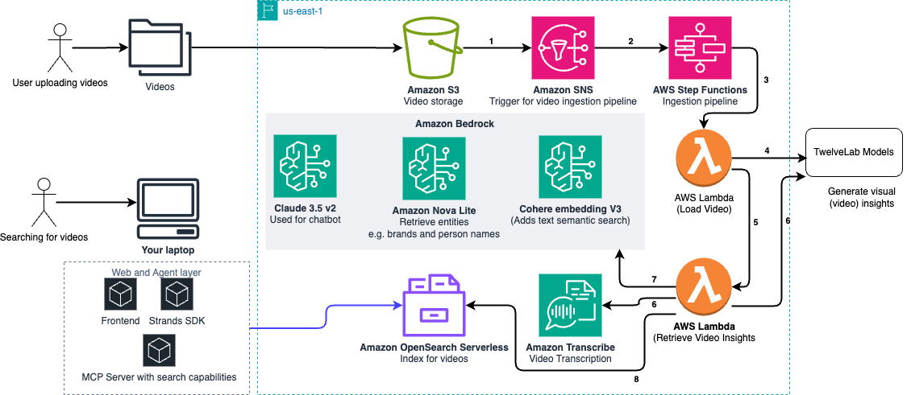

# Intelligent Video Search AI Agent with Strands SDK

## Summary

This solution creates a serverless video processing pipeline that automatically triggers when videos are uploaded to S3, analyzes them using Twelve Labs' advanced AI models via their official Python SDK, and stores rich insights in a RAG-capable OpenSearch index. The pipeline captures visual, audio, and text elements to enable powerful semantic and keyword-based searches for marketing teams. The solution leverages Strands SDK AI Agentic solution to orchestrate user requests and find the best content to the user needs. 

## Tags

- bedrock
- twelvelabs
- python
- demo
- strands
- agents
- real-time-data
- fastapi
- react
- nova
- claude
- video-insights

## Technologies

- AWS SDK (boto3)
- AWS StepFunctions
- Amazon Bedrock
- Amazon OpenSearch Serverless
- Amazon Nova
- Amazon Transcribe
- FastAPI
- MCP
- Strands Agents SDK
- Python 3.11+
- React
- Tailwind CSS
- TwelveLabs SDK

## 🚀 Quick Start

```bash
# 1. Clone and navigate to the project
cd intelligent-video-search-ai-agent

# 2. Deploy the complete AWS pipeline
./deploy.sh -b your-videos-bucket -d your-deployment-bucket -a YOUR_TWELVE_LABS_API_KEY --create-index

# 3. Upload a video to test the pipeline
aws s3 cp test-video.mp4 s3://your-videos-bucket/videos/

# 4. Set up the complete application stack
# 4.1. Create Python virtual environment
python -m venv .venv
source .venv/bin/activate  # On Windows: .venv\Scripts\activate

# 4.2. Install Python dependencies
pip install -r requirements.txt

# 4.3. Configure environment variables (see Environment Variables section)
export AWS_REGION=us-east-1
export OPENSEARCH_ENDPOINT=your-opensearch-endpoint
export OPENSEARCH_INDEX=video-insights-rag
# ... (see full list below)

# 5. Start MCP Server (Terminal 1) - default port is 8009, update port if required on .env
cd MCP/
python 1-video-search-mcp.py

# 6. Start Strands SDK Agent (Terminal 2) - default port is 8090, update port if required on .env
cd ../agent/
python 1-ai-agent-video-search-strands-sdk.py

# 7. Start React Frontend (Terminal 3) - Port 3000
cd ../frontend/video-insights-ui/
npm install
npm start

# 8. Access the application
# - Frontend UI: http://localhost:3000
# - Agent API: http://localhost:8080
# - MCP Server: http://localhost:8009
```

## 🔧 Environment Variables

Create a `.env` file or set these environment variables:

```bash
# AWS Configuration
export AWS_REGION=us-east-1
export AWS_PROFILE=default  # Optional: if using specific AWS profile

# OpenSearch Configuration (from CloudFormation outputs)
export OPENSEARCH_ENDPOINT=your-domain.us-east-1.aoss.amazonaws.com
export OPENSEARCH_INDEX=video-insights-rag

# Bedrock Configuration for AI Agent
export BEDROCK_MODEL_ID=us.anthropic.claude-3-5-sonnet-20241022-v2:0

# MCP Server Configuration
export MCP_HOST=localhost
export MCP_PORT=8009

# Agent API Configuration  
export API_HOST=localhost
export API_PORT=8090

# Optional: Cohere for enhanced embeddings
export COHERE_API_KEY=your-cohere-api-key

# Twelve Labs (handled by AWS Secrets Manager)
export TWELVE_LABS_API_KEY_SECRET=twelve-labs-api-key
```

**Note:** 
- Get OpenSearch endpoint from CloudFormation stack outputs after deployment
- If you need videos for testing, use sample dataset from HuggingFace (see `data/README.md`)

## Architecture Overview



### High-level pipeline flow

The pipeline follows an event-driven architecture:
1. **S3 Upload** → EventBridge triggers Step Functions
2. **Step Functions** orchestrates video processing workflow
3. **Lambda Functions** handle API integrations using Twelve Labs SDK
4. **Twelve Labs APIs** extract comprehensive video insights via SDK
5. **OpenSearch Serverless** stores and indexes all metadata for search

### Key components and services

- **AWS Step Functions**: Orchestration engine for the entire workflow
- **AWS Lambda**: Serverless compute for processing logic with Twelve Labs SDK
- **Amazon S3**: Video storage and temporary metadata storage
- **Amazon EventBridge**: Event routing from S3 to Step Functions
- **Twelve Labs Python SDK**: Official SDK for Marengo embeddings and Pegasus insights
- **Amazon OpenSearch Serverless**: Vector and keyword search capabilities
- **AWS Secrets Manager**: Secure API key storage

## 💡 Technical Implementation

The system uses a serverless architecture with these core components:

- **AWS Step Functions**: Orchestrates the video processing workflow
- **AWS Lambda**: Serverless compute for processing logic
- **Amazon S3**: Video storage and metadata backup
- **Amazon EventBridge**: Event routing from S3 to Step Functions
- **Twelve Labs Python SDK**: Video analysis with Marengo and Pegasus models
- **Amazon OpenSearch Serverless**: Vector and keyword search capabilities
- **Amazon Bedrock**: Cohere embeddings for text search and Amazon Nova Lite to retrieve entities (e.g. brand and person names)
- **Amazon Transcribe**: Generate video transcription
- **AWS Secrets Manager**: Secure API key storage

### Data Flow:
1. Video uploaded to S3 → EventBridge triggers Step Functions
2. InitiateVideoProcessing creates Twelve Labs index and signed URL
3. ExtractInsightsFunction processes video, generates embeddings, and indexes to OpenSearch

## 📋 Prerequisites

- **AWS Account** with appropriate permissions:
  - Amazon Bedrock access (Claude 3.5 Sonnet v2, Cohere v3 and Nova Lite models)
  - Amazon OpenSearch Serverless permissions
  - Lambda, Step Functions, S3, EventBridge, Secrets Manager
- **AWS CLI** installed and configured
- **Python 3.11+** installed (3.11+ recommended)
- **Node.js 16+** and npm (for React frontend)
- **Twelve Labs API key** ([sign up at twelvelabs.io](https://twelvelabs.io))
- **HuggingFace account** (optional, for sample video datasets)

## 🧪 Testing the Pipeline

### 1. Upload a test video
```bash
# Upload a video to trigger processing
aws s3 cp test-video.mp4 s3://your-video-bucket/videos/test-video.mp4

# Monitor Step Functions execution
aws stepfunctions list-executions \
  --state-machine-arn YOUR_STATE_MACHINE_ARN \
  --max-items 1
```

### 2. Search for videos
Open the webserver (localhost:3000) and search for your video insights.
```

## 🔍 Search Capabilities

The system provides comprehensive video search through the MCP server with these capabilities:

### Search Methods

- **Keyword Search** (`search_videos_by_keywords`): 
  - Search across multiple fields (title, summary, topics, brands, companies, people)
  - Configurable search fields for targeted queries
  - Boolean query matching

- **Semantic Search** (`search_videos_by_semantic_query`):
  - Natural language queries using AI embeddings
  - Powered by Cohere embeddings via Amazon Bedrock
  - K-nearest neighbors (KNN) vector search

- **Hybrid Search** (`search_videos_hybrid`):
  - Combines keyword and semantic search
  - Configurable weight balance (default: 70% semantic, 30% keyword)
  - Best of both approaches for comprehensive results

- **Title Search** (`search_videos_by_title`):
  - Fuzzy matching for typo tolerance
  - Exact match option available
  - Optimized for finding specific videos

### Video Analysis Tools

- **Video Details** (`get_video_details`):
  - Comprehensive video information
  - Optional transcript, chapters, and marketing metrics
  - All metadata in one call

- **Person Search** (`search_person_in_video`):
  - Find when specific people are mentioned
  - Returns timestamps and transcript context
  - Perfect for locating interview segments

- **Sentiment Analysis** (`get_video_sentiment`):
  - Emotional tone and sentiment scoring
  - Marketing effectiveness insights

- **Video Summary** (`get_video_summary`):
  - AI-generated summaries
  - Key topics and hashtags
  - Brand and entity mentions

- **Transcript Access** (`get_video_transcript`):
  - Full transcript text
  - Segment-by-segment with timestamps
  - Speaker-labeled format

### Searchable Content
- Video titles and descriptions
- AI-generated summaries and topics
- Full transcripts with timestamps
- Detected entities (brands, companies, people)
- Marketing metrics and sentiment
- Visual content descriptions
- Hashtags and keywords

## 📁 Project Structure

```
intelligent-video-search-ai-agent/
├── deploy.sh                          # One-click deployment script
├── infrastructure.yaml                # CloudFormation template
├── step-functions-definition.json     # Step Functions state machine
├── requirements.txt                   # Python dependencies
├── .gitignore                         # Git ignore patterns
├── images/                            # Documentation images
│   └── video-search-arch.png          # Architecture diagram
├── MCP/                               # Model Context Protocol Server
│   ├── 1-video-search-mcp.py          # MCP server (port 8009)
│   └── README.md                      # MCP setup instructions
├── agent/                             # Strands SDK AI Agent ("Nick")
│   ├── 1-ai-agent-video-search-strands-sdk.py  # AI agent (port 8080)
│   ├── 2-test_agent.py                # Agent test suite & troubleshooting
│   └── README.md                      # Agent setup instructions
├── data/                              # Sample datasets and data tools
│   ├── download.py                    # HuggingFace dataset downloader
│   └── README.md                      # Data setup instructions
├── data_ingestion/
│   └── 1-create-opensearch-index.py   # OpenSearch index creation
├── frontend/video-insights-ui/        # React Frontend (port 3000)
│   ├── src/                           # React source code
│   │   ├── components/                # React components
│   │   │   └── VideoInsightsChat/     # Chat UI components
│   │   │       ├── index.tsx          # Main chat component
│   │   │       ├── MessageFormatter.tsx # Markdown message formatting
│   │   │       ├── VideoCard.tsx      # Video result display
│   │   │       └── SearchFilters.tsx  # Search filter UI
│   │   ├── hooks/                     # Custom React hooks
│   │   └── types/                     # TypeScript definitions
│   ├── public/                        # Static assets
│   ├── package.json                   # NPM dependencies
│   └── README.md                      # Frontend setup instructions
└── lambdas/                           # AWS Lambda Functions
    ├── InitiateVideoProcessing/        # Trigger video processing
    │   └── src/
    │       ├── main.py                # Lambda handler
    │       └── requirements.txt       # Lambda dependencies
    ├── ExtractInsightsFunction/        # Extract insights + index to OpenSearch
    │   └── src/
    │       ├── main.py                # Lambda handler
    │       └── requirements.txt       # Lambda dependencies
    └── SearchVideosFunction/           # Search processed videos (unused in UI)
```

## 🔍 Application Components

### MCP Server (Model Context Protocol)
**Location**: `MCP/1-video-search-mcp.py` | **Port**: 8009

The MCP Server provides backend search and analysis capabilities:

- **Search Types**: Keyword, semantic, and hybrid search across video metadata
- **Video Analysis**: Sentiment analysis, person/entity detection, transcript access  
- **Marketing Insights**: Brand detection, company mentions, marketing metrics
- **Real-time Access**: Direct connection to OpenSearch for live video data

```bash
# Start MCP Server
cd MCP/
python 1-video-search-mcp.py

# Test MCP Server
curl http://localhost:8009/health
```

### Strands SDK AI Agent ("Nick")
**Location**: `agent/1-ai-agent-video-search-strands-sdk.py` | **Port**: 8080

"Nick" is an AI-powered chatbot that serves as the intelligent interface:

- **Natural Language Processing**: Powered by Amazon Bedrock (Claude 3.5 Sonnet)
- **Conversational Interface**: Maintains context across chat sessions
- **Multiple Access Methods**: REST API and WebSocket for real-time streaming
- **Marketing Focus**: Specialized in video content discovery and analysis
- **Built-in Protections**: Stays on-topic, redirects non-video requests

```bash
# Start AI Agent
cd agent/
python 1-ai-agent-video-search-strands-sdk.py

# Test Agent API
curl http://localhost:8080/health
```

### React Frontend  
**Location**: `frontend/video-insights-ui/` | **Port**: 3000

React-based web interface for user interactions:

- **Technology**: Create React App with TypeScript
- **UI Framework**: Tailwind CSS for styling
- **Real-time Communication**: WebSocket integration with AI agent
- **Video Display**: Rich video insights and search results

```bash
# Start Frontend
cd frontend/video-insights-ui/
npm install
npm start

# Build for production
npm run build
```

## 🧪 Testing and Troubleshooting

### Agent Test Suite

The project includes a comprehensive test script (`agent/2-test_agent.py`) to verify the agent and all its endpoints are working correctly.

**What it tests:**
- ✅ Health check endpoint
- ✅ Chat REST API endpoint
- ✅ WebSocket streaming connection
- ✅ Search suggestions endpoint
- ✅ Session history management
- ✅ Video context tracking
- ✅ History clearing functionality

**Running the tests:**
```bash
# Make sure MCP server and Agent are running first
cd agent/
python 2-test_agent.py
```

**Test scenarios include:**
- Basic video search requests
- Sentiment analysis queries
- Off-topic request handling (e.g., "write code" - should be rejected)
- Brand/company searches
- WebSocket real-time streaming
- Session context persistence

**Common troubleshooting:**
- **Connection refused**: Verify agent is running on correct port (default: 8090)
- **Port mismatch**: Set `API_PORT` environment variable if using non-default port
- **MCP errors**: Ensure MCP server is running before starting the agent
- **Timeout errors**: Check if all services have fully started

**Expected output:**
```
🏥 Testing health check...
✅ Health check passed: {'status': 'online', 'service': 'Nick - Video Insights API'}

💬 Testing chat endpoint...
📤 Sending: Hi Nick, can you help me find videos about construction?
✅ Response received:
   I'll search for videos about construction for you...

🔌 Testing WebSocket endpoint...
📊 Status: Searching video database...
🔧 Using tool: search_videos_by_keywords - Searching by keywords...
✅ WebSocket streaming completed
```

The test script helps verify:
- All API endpoints are responsive
- Agent properly connects to MCP server
- Search functionality works correctly
- WebSocket streaming delivers real-time updates
- Session management maintains context

## 🔧 Advanced Configuration

### Custom Deployment
```bash
./deploy.sh --help  # See all options
```

### Additional Environment Variables
- `TWELVE_LABS_API_KEY_SECRET`: Secrets Manager secret name
- `INDEX_NAME`: OpenSearch index name (default: video-insights-rag)
- `COHERE_MODEL_ID`: Bedrock Cohere model ID (default: cohere.embed-english-v3)

## 🎯 Key Features

- **Serverless Architecture**: Scales automatically, pay per use
- **Dual Embedding Search**: Visual (Twelve Labs) + Text (Cohere) embeddings
- **Multi-Modal Analysis**: Video, audio, text, and visual insights
- **Marketing Focus**: Brand detection, sentiment analysis, key moments
- **Production Ready**: Error handling, monitoring, logging included

## 📝 Notes

- **Project scope**: This project is for educational purposes and is not designed for production use. For production use, please implement proper security, scalability, and compliance measures appropriate for your use case.
- **Video Requirements**: MP4, MOV, or AVI under 2GB, 480x360 to 4K resolution
- **Processing Time**: Typically 5-15 minutes depending on video length
- **Costs**: Pay for AWS Lambda, OpenSearch, and Twelve Labs API usage
- **Twelve Labs Models**: Uses Marengo 2.7 for embeddings and Pegasus 1.2 for insights

## 🗑️ Cleanup and Resource Deletion

**IMPORTANT**: To avoid ongoing AWS charges, follow these steps to completely remove all resources when you're done testing:

### 1. Delete CloudFormation Stack
```bash
# Get your stack name (usually 'video-ingestion-pipeline' or similar)
aws cloudformation list-stacks --stack-status-filter CREATE_COMPLETE UPDATE_COMPLETE

# Delete the main stack (this removes most resources)
aws cloudformation delete-stack --stack-name YOUR_STACK_NAME

# Wait for deletion to complete
aws cloudformation wait stack-delete-complete --stack-name YOUR_STACK_NAME
```

### 2. Delete OpenSearch Serverless Collection
```bash
# List OpenSearch collections
aws opensearchserverless list-collections

# Delete the collection (replace with your collection name)
aws opensearchserverless delete-collection --id YOUR_COLLECTION_NAME
```

### 3. Empty and Delete S3 Buckets
```bash
# Empty your video bucket first
aws s3 rm s3://your-videos-bucket --recursive

# Empty your deployment bucket (if separate)
aws s3 rm s3://your-deployment-bucket --recursive

# Delete the buckets
aws s3 rb s3://your-videos-bucket
aws s3 rb s3://your-deployment-bucket
```

### 4. Delete Secrets Manager Secrets
```bash
# Delete the Twelve Labs API key secret
aws secretsmanager delete-secret --secret-id twelve-labs-api-key --force-delete-without-recovery
```

### 5. Clean Up EventBridge Rules (if any remain)
```bash
# List rules to find video-related ones
aws events list-rules

# Delete any video processing rules (replace RULE_NAME)
aws events delete-rule --name RULE_NAME
```

### 6. Verify All Resources Deleted
```bash
# Check for remaining Lambda functions
aws lambda list-functions --query 'Functions[?contains(FunctionName, `video`) || contains(FunctionName, `Video`)]'

# Check for remaining Step Functions
aws stepfunctions list-state-machines --query 'stateMachines[?contains(name, `video`) || contains(name, `Video`)]'

# Check for remaining IAM roles (may need manual cleanup)
aws iam list-roles --query 'Roles[?contains(RoleName, `video`) || contains(RoleName, `Video`)]'
```

### 7. Delete Strands, MCP and UI
Strands, MCP and UI are running as script, stop and delete them for your laptop or the computing device hosting them.

### 8. Monitor Billing Dashboard
- Check your [AWS Billing Dashboard](https://console.aws.amazon.com/billing/home) for any remaining charges
- Look specifically for:
  - Lambda executions
  - OpenSearch Serverless compute/storage
  - S3 storage
  - Bedrock API calls
  - Step Functions executions

### Resources That May Incur Charges
- **OpenSearch Serverless**: Charges for compute and storage even when idle
- **S3 Storage**: Charges for stored videos and metadata
- **Lambda**: Charges per execution and duration
- **Bedrock**: Charges per API call/token
- **Step Functions**: Charges per state transition
- **Twelve Labs API**: External service charges (outside AWS)

### Quick Cleanup Script
For convenience, you can use this one-liner (replace with your actual names):
```bash
# WARNING: This will delete everything - make sure you have the right names!
aws cloudformation delete-stack --stack-name YOUR_STACK_NAME && \
aws opensearchserverless delete-collection --id YOUR_COLLECTION_NAME && \
aws s3 rm s3://your-videos-bucket --recursive && \
aws s3 rb s3://your-videos-bucket && \
aws secretsmanager delete-secret --secret-id twelve-labs-api-key --force-delete-without-recovery
```

**⚠️ Double-check all resource names before running cleanup commands to avoid deleting unrelated resources!**

## Security

See [CONTRIBUTING](../../CONTRIBUTING.md#security-issue-notifications) for more information.

## License

This library is licensed under the MIT-0 License. See the [LICENSE](../../LICENSE) file.